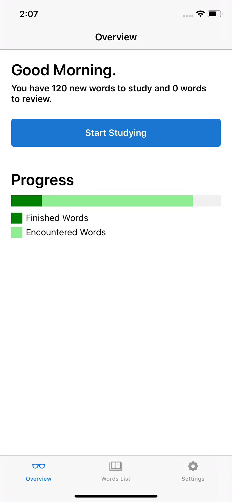
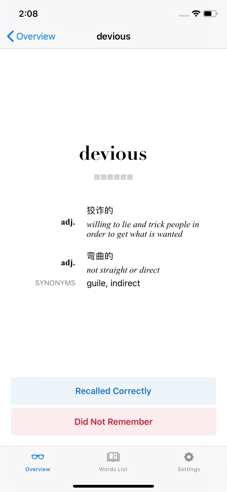
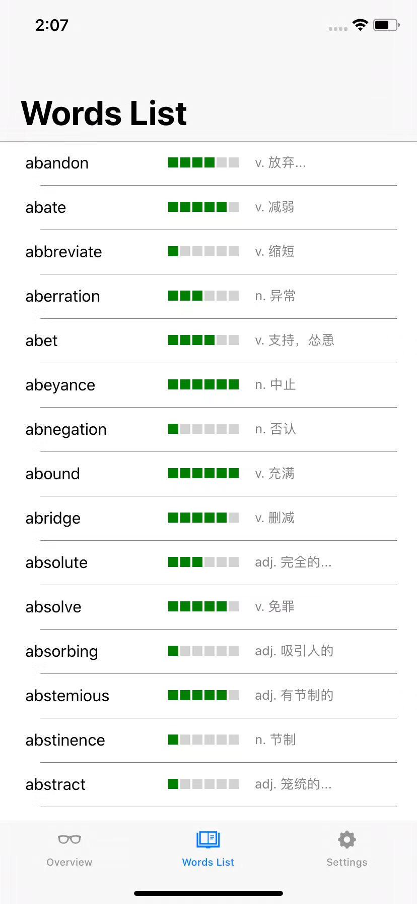
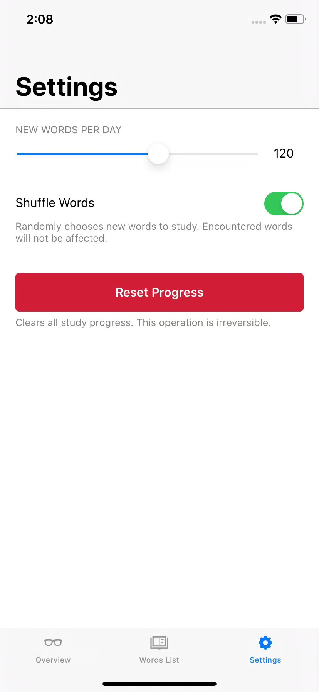

# GRE Vocab Builder
This is a simple mobile app to help me memorize GRE vocab. Data source can be found [here](https://quizlet.com/zhangweiteacher).

# Language and Dependencies 
This project (under `GREVocab`) is written in C# using the Xamarin Framework, with dependencies (SQLite and JSON parser) resolvable in Visual Studio. The python script `data-clean.py` scrapes the data source (HTML pages) and extracts the listed words into a json format. For clarity, the raw and cleaned data are removed (but can be recovered from the git history anyways :)).

# Screenshots
Home Page|Word Detail Page|Word Lists|Settings Page
:---:|:---:|:---:|:---:|
 |  |  | 
